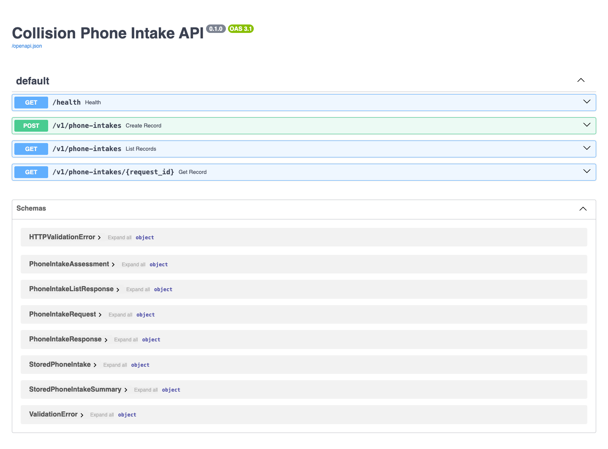
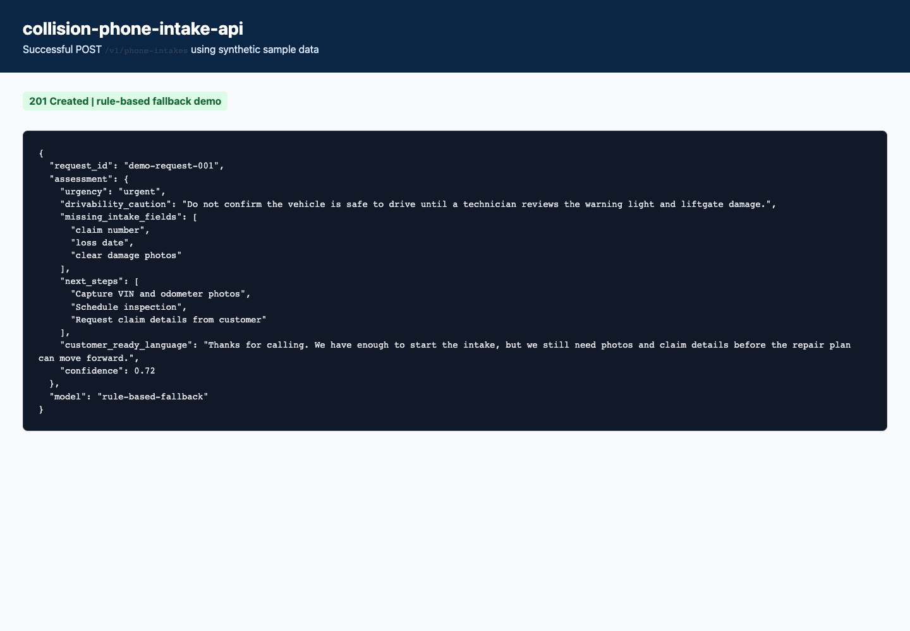
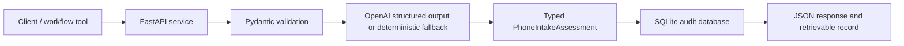

# Collision Phone Intake API

A deployable FastAPI service for Precision Auto Body's **AI phone intake** workflow. It demonstrates typed AI outputs, deterministic fallback behavior, SQLite audit persistence, production-style JSON logging, Docker packaging, CI, Railway deployment notes, and synthetic public demo data.

> This service is an assistive workflow tool. It does not make final safety, repair, insurance, financial, or outbound communication decisions.

## Portfolio Status

- Local validation: complete
- GitHub remote: published at https://github.com/dkdejesus/collision-phone-intake-api
- Railway deployment: pending dashboard deployment
- Demo data policy: synthetic only

## Live demo

Add Railway URLs after deployment:

- API health: `https://<railway-domain>/health`
- Swagger docs: `https://<railway-domain>/docs`





## Case study

### Business problem

Phone calls often arrive with incomplete vehicle, claim, and drivability details, creating rework before the shop can schedule or triage the repair.

### Workflow context

This service converts a synthetic phone-call note into a structured operational intake handoff. The public version is synthetic-first: every fixture is made-up and safe to publish.

### Architecture



### What it returns

- `urgency`
- `drivability_caution`
- `missing_intake_fields`
- `next_steps`
- `customer_ready_language`
- `confidence`

### Measurable impact hypothesis

A production version could reduce manual review time for this workflow by turning scattered notes into structured handoffs, missing-item checks, and human-approved next actions.

## API endpoints

- `POST /v1/phone-intakes` creates a workflow assessment.
- `GET /v1/phone-intakes` lists recent assessment summaries.
- `GET /v1/phone-intakes/{request_id}` retrieves a stored assessment.
- `POST /v1/webhooks/vapi/intake-call` receives Vapi end-of-call reports and creates phone intake records.
- `GET /health` supports deployment health checks.

## Vapi phone-call automation

Use this service for phone-call intake automation. Vapi should send final call reports here:

```text
https://<railway-domain>/v1/webhooks/vapi/intake-call
```

Recommended first Vapi configuration:

- Send `end-of-call-report` events.
- Treat transcript/status updates as informational only.
- Add a webhook secret and send it as `x-vapi-webhook-secret`.
- Keep human review required before customer-facing, insurer-facing, financial, repair, or drivability decisions.

The webhook converts Vapi's final transcript into a normal phone intake record. Non-final events are acknowledged but ignored so the intake history is not filled with partial call fragments.

## Example request

```bash
curl -X POST http://localhost:8000/v1/phone-intakes \
  -H 'Content-Type: application/json' \
  -d @sample_data/sample_request.json
```

## Example response

```json
{
  "request_id": "demo-request-001",
  "assessment": {
    "urgency": "urgent",
    "drivability_caution": "Do not confirm the vehicle is safe to drive until a technician reviews the warning light and liftgate damage.",
    "missing_intake_fields": [
      "claim number",
      "loss date",
      "clear damage photos"
    ],
    "next_steps": [
      "Capture VIN and odometer photos",
      "Schedule inspection",
      "Request claim details from customer"
    ],
    "customer_ready_language": "Thanks for calling. We have enough to start the intake, but we still need photos and claim details before the repair plan can move forward.",
    "confidence": 0.72
  },
  "model": "rule-based-fallback"
}
```

## Run locally

```bash
python -m venv .venv
source .venv/bin/activate
pip install -r requirements.txt
cp .env.example .env
uvicorn app.main:app --reload
```

Open Swagger UI at `http://localhost:8000/docs`.

## Run with Docker

```bash
docker build -t collision-phone-intake-api .
docker run --rm -p 8000:8000 --env-file .env collision-phone-intake-api
```

## Deploy on Railway

1. Push this repository to GitHub.
2. Create a Railway project from the GitHub repository.
3. Railway will detect the `Dockerfile` and use `railway.toml` for the `/health` deployment check.
4. Add service variables:

```text
APP_ENV=production
LOG_LEVEL=INFO
OPENAI_API_KEY=<your key>
OPENAI_MODEL=gpt-5-mini
REQUEST_TIMEOUT_SECONDS=30
DATABASE_PATH=/data/phone_intake.db
VAPI_WEBHOOK_SECRET=<shared Vapi webhook secret>
```

5. Add a volume mounted at `/data` so saved records survive redeploys.
6. Generate a public domain from the service Networking settings.

## Test

```bash
pytest -q
ruff check .
ruff format --check .
docker build -t collision-phone-intake-api:ci .
```

## Production considerations

- Keep customer, VIN, claim, phone, email, insurer, and photo data out of public demos.
- Put the container behind HTTPS and an authenticated gateway.
- Add rate limiting before public production traffic.
- Human review remains required for safety, repair, insurance, financial, and outbound communication decisions.
- Validate CCC ONE, Gmail, Google Calendar, Google Drive, QuickBooks, vendor, and carrier access before live integrations.

## Portfolio talking points

- Designed a typed AI workflow API around a real collision repair operating process.
- Used synthetic fixtures so the project is public-safe.
- Implemented deterministic fallback behavior so demos and tests work without an API key.
- Added request IDs, JSON logs, persistence, health checks, validation, tests, Docker, and Railway deployment notes.
